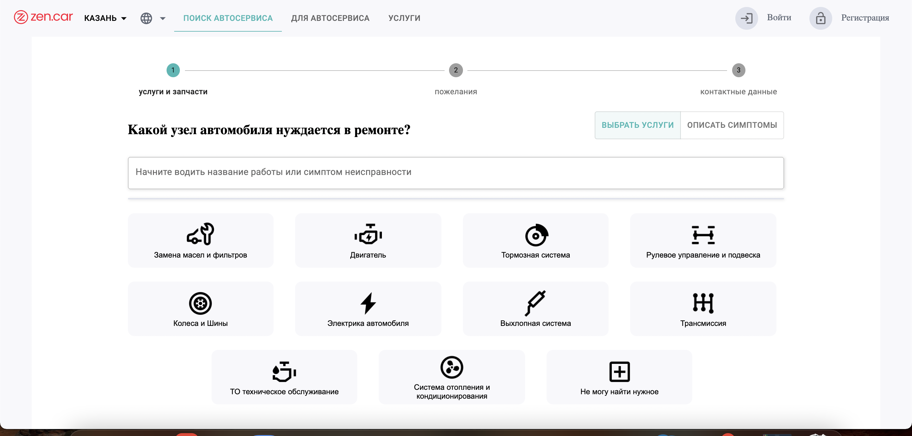
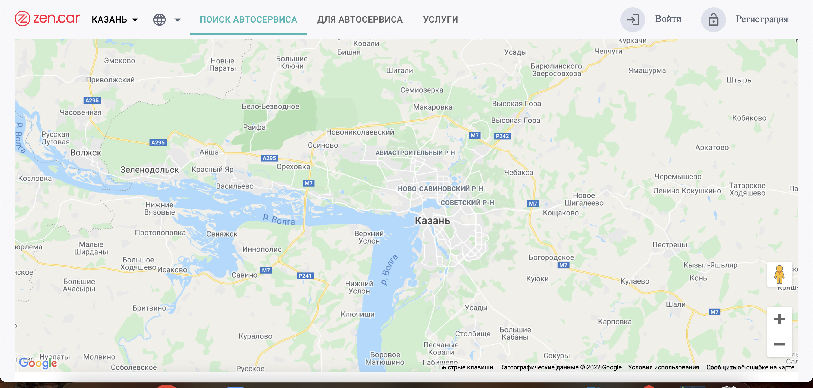
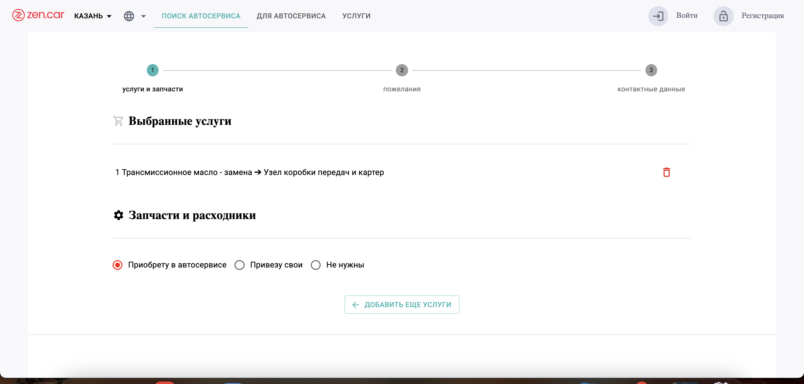

# ZEN.CAR App

## О проекте:

Этот проект является частичной копией https://zen.car.

Моей задачей было повторить функционал из этой части приложения: https://zen.car/repair-wizard. 







Здесь пользователь может пошагово выбирать услуги/симпотомы и в итоге получает конечный список работ, который сохраняется в Local storage, что дает возможность вернуться к нему из любой части приложения. Так же функционал приложения позволяет пользователю перемещаться назад по дереву услуг и изменять список добавляя новые и удаляя не нужные работы из списка.

Данные о услугах и симптомах предоставляет API реализованное с помощью [GraphQl](https://graphql.org/).

Для интеграции с Google Maps я использовал библиотеку [Google-maps-react](https://www.npmjs.com/package/google-maps-react)

Добавлена функция автоматического определения геолокации( так что открывая мое приложение, знайте я слежу за вами) шутка, google сможет это сделать только в том случае если вы ему позволите.

Так же в приложении используется [Firebase](https://console.firebase.google.com/), благодоря чему добавлен функционал регистрации нового пользователя(клиента)  и  дальнешей его аутентификации на основе предоставленого адреса электронной почты и пароля. 

В добавок мы имеем возможность  переводить  текст приложения с русского языка на английский  и наоборот, для добавления этой фичи я воспользовался [i18Next](https://react.i18next.com/)


### Для разработки приложения я использовал следующие инструменты:

* [React.js](https://reactjs.org/)

* [Redux](https://redux.js.org/)

* [React-router-dom](https://v5.reactrouter.com/)

* [Firebase](https://console.firebase.google.com/)

* [GraphQl](https://graphql.org/)

* [AppoloGraphQl](https://www.apollographql.com/)

* [Lodash](https://lodash.com/)

* [Google-maps-react](https://www.npmjs.com/package/google-maps-react)

* [i18Next](https://react.i18next.com/)

* [Material-UI](https://mui.com/)


В тeкущей ветке вы можете ознакомиться с кодом.

[Tут]( https://sergey-shar.github.io/zen-car-project/) посмотреть на  работу приложения в браузере. 


Быстрый старт:

- Склонировать репозиторий

```
  git clone
```

- Установить зависимости

```
  yarn install
```

- Запустить проект

```
  yarn start
```


